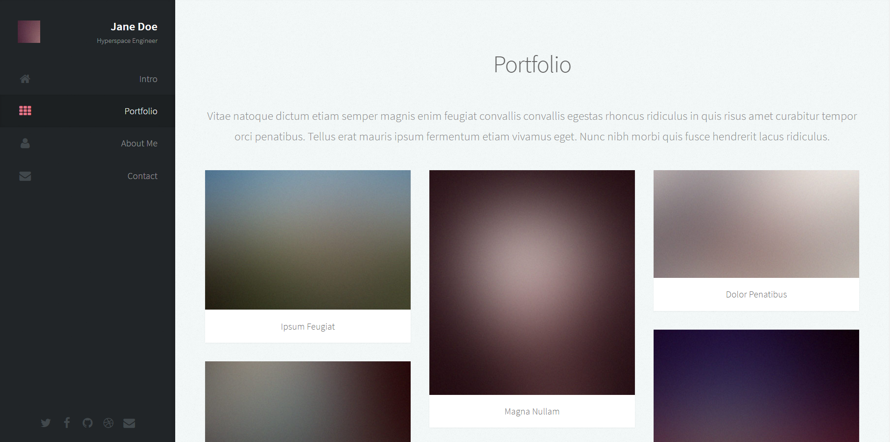
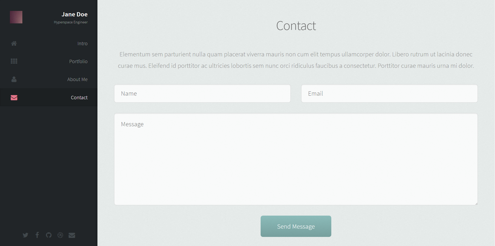
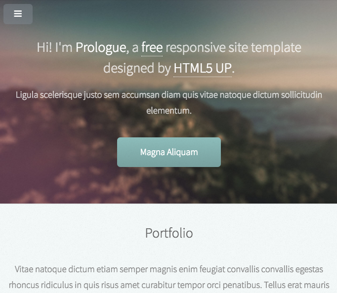
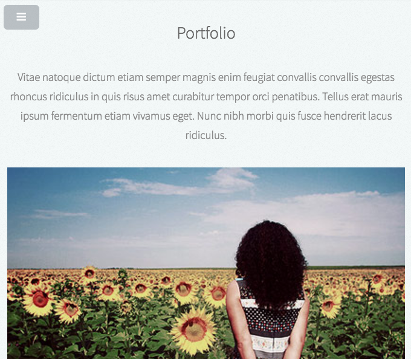
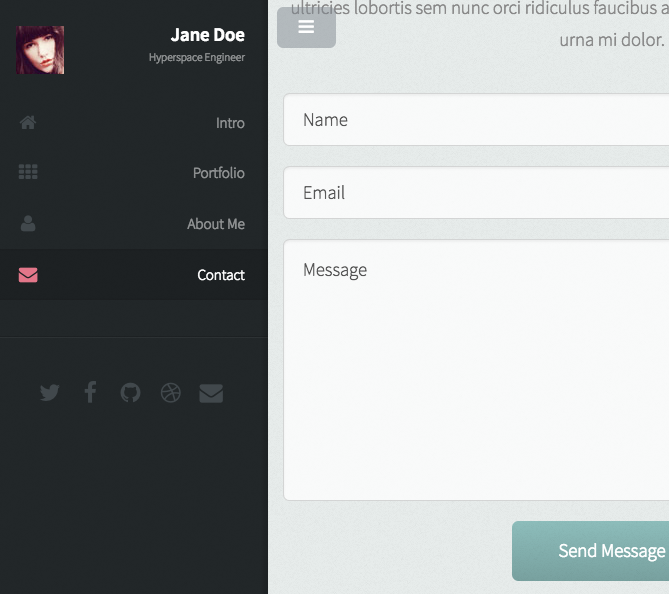

## Lecture task

Recreate template from lecture `html-css-part-1` using preprocessor and BEM.

Getting Started
- Copy and setup project from folder `boilerplate`
- Install dependencies: `npm i`
- Run `npm start` to preview and watch for changes

Mandatory task:

1. Sass/PostCSS
2. BEM
3. Flexbox
4. Responsive design with one or two breakpoints.
5. Responsive Slide Toggle Menu (can be without JS, just create toggle class)

Advanced:

6. SVG icons in navigation menu
7. Another simplified version of this template using Bootstrap 3.

### Examples

Mobile

### Once finished..

1. Push your folder in *lectures/03_html_css_part-2/{firstname-lastname}*
2. Call a lecturer and show your page.